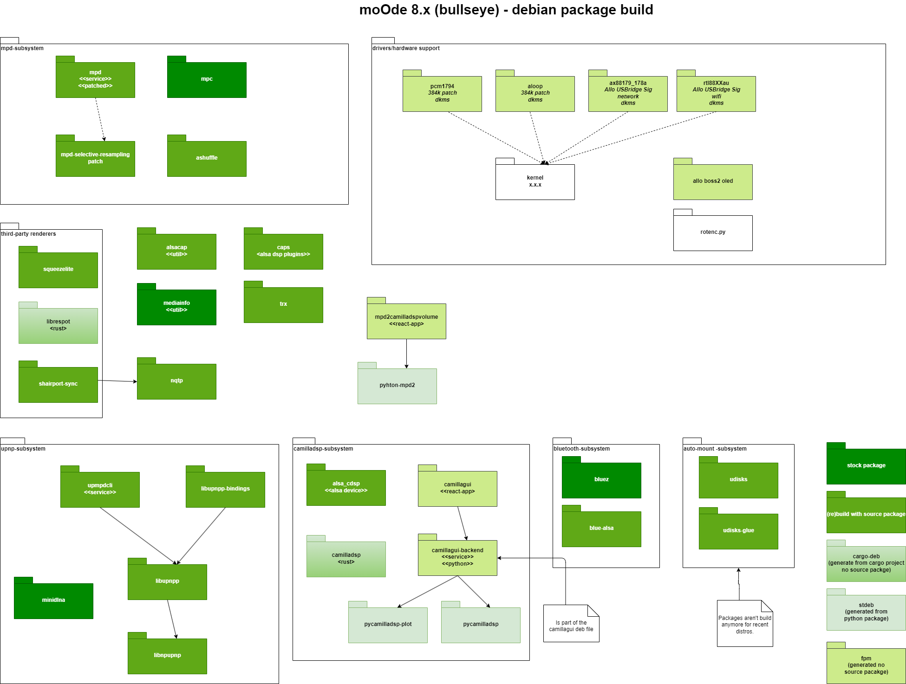

# moOde audio player - package builder <!-- omit in toc -->
by bitlab


[](https://cloudsmith.com)

Package repository hosting is graciously provided by  [Cloudsmith](https://cloudsmith.com).
Cloudsmith is the only fully hosted, cloud-native, universal package management solution, that
enables your organization to create, store and share packages in any format, to any place, with total
confidence.

### Disclaimer ###

The software contained in this repository is distributed under the [GNU GENERAL PUBLIC LICENSE Version 3](https://raw.githubusercontent.com/moode-player/pkgbuild/main/LICENSE) which includes the following disclaimer:

>15. Disclaimer of Warranty.
>
>THERE IS NO WARRANTY FOR THE PROGRAM, TO THE >EXTENT PERMITTED BY
>APPLICABLE LAW.  EXCEPT WHEN OTHERWISE STATED IN WRITING THE COPYRIGHT
>HOLDERS AND/OR OTHER PARTIES PROVIDE THE PROGRAM "AS IS" WITHOUT WARRANTY
>OF ANY KIND, EITHER EXPRESSED OR IMPLIED, INCLUDING, BUT NOT LIMITED TO,
>THE IMPLIED WARRANTIES OF MERCHANTABILITY AND FITNESS FOR A PARTICULAR
>PURPOSE.  THE ENTIRE RISK AS TO THE QUALITY AND PERFORMANCE OF THE PROGRAM
>IS WITH YOU.  SHOULD THE PROGRAM PROVE DEFECTIVE, YOU ASSUME THE COST OF
>ALL NECESSARY SERVICING, REPAIR OR CORRECTION.
>
>16. Limitation of Liability.
>
>IN NO EVENT UNLESS REQUIRED BY APPLICABLE LAW OR AGREED TO IN WRITING
>WILL ANY COPYRIGHT HOLDER, OR ANY OTHER PARTY WHO MODIFIES AND/OR CONVEYS
>THE PROGRAM AS PERMITTED ABOVE, BE LIABLE TO YOU FOR DAMAGES, INCLUDING ANY
>GENERAL, SPECIAL, INCIDENTAL OR CONSEQUENTIAL DAMAGES ARISING OUT OF THE
>USE OR INABILITY TO USE THE PROGRAM (INCLUDING BUT NOT LIMITED TO LOSS OF
>DATA OR DATA BEING RENDERED INACCURATE OR LOSSES SUSTAINED BY YOU OR THIRD
>PARTIES OR A FAILURE OF THE PROGRAM TO OPERATE WITH ANY OTHER PROGRAMS),
>EVEN IF SUCH HOLDER OR OTHER PARTY HAS BEEN ADVISED OF THE POSSIBILITY OF
>SUCH DAMAGES.

This means that the user of this software is responsible for any damage resulting from its use.
It does not matter if the damage is caused by incorrect usage or a bug in the software.

### Table of Contents <!-- omit in toc -->

- [1. Introduction](#1-introduction)
  - [1.1. Origin and build type](#11-origin-and-build-type)
  - [1.2. Overview of the packages that are used](#12-overview-of-the-packages-that-are-used)
  - [1.3. Other packages in the repo for example drivers.](#13-other-packages-in-the-repo-for-example-drivers)
- [2. (Re)building packages](#2-rebuilding-packages)
  - [2.1. Prepare environment](#21-prepare-environment)
    - [2.1.1. Update the system](#211-update-the-system)
    - [2.1.2. Clone the pkgbuild tree](#212-clone-the-pkgbuild-tree)
    - [2.1.3. Setup environment settings](#213-setup-environment-settings)
  - [2.2. Build dependencies](#22-build-dependencies)
  - [2.3. Building a package](#23-building-a-package)
  - [2.4. Deploy package and source](#24-deploy-package-and-source)
    - [2.4.1. Install Cloudsmith tooling](#241-install-cloudsmith-tooling)
    - [2.4.2. Upload the package](#242-upload-the-package)


# 1. Introduction
This repository contains scripts to build the packages containing the software components used in moOde audio player.

## 1.1. Origin and build type
There are several ways in which packages are built and sources obtained.

| How   | Description |  Output        |
|------------|-------------| --|
| backport   | Download source package  | deb+src |
| [cargo-deb](https://github.com/kornelski/cargo-deb)  | Git clone source, generate package from rust project with cargo-deb| deb |
| rebuild    | Rebuild from stock package source | deb+src |
| [fpm](https://github.com/jordansissel/fpm)   | Git clone source, generate package with FPM| deb |
| git        | Clone source, contains debian directory | deb+src |
| git+debsrc | Clone source, use debian dir from older version | deb+src |
| git+dhmake | Clone source and create new package | deb+src |
| [stdeb](https://github.com/astraw/stdeb)   | Git clone source, generate package with stdeb| deb+src |
| [stock](https://packages.debian.org/bullseye/)      | No need to build, use stock available | - |

All forms with src as output can be rebuilt from source packages (also present in the repo).

## 1.2. Overview of the packages that are used

Note: The versions represented in the table are only for example and may not represent the latest versions being used and the table may not contain all the packages in the repo.

| Package    |      Version    | How  | Patches* |
|----------  |-----------------|:----|---------------|
| [alsa-cdsp](https://github.com/scripple/alsa_cdsp)  | 1.2.0-1moode1  | git+dh_make | yes |
| [alsacap](https://github.com/bubbapizza/alsacap)    | 1.0.1-1moode1  | git+dh_make |  |
| [ashuffle](https://github.com/joshkunz/ashuffle)   | 3.12.5-1moode1 | git+dh_make |  |
| [*bluez*](https://github.com/bluez/bluez)      | *5.55-3.1+rpt1* | ***stock*** |
| [bluez-alsa](https://github.com/Arkq/bluez-alsa) | 4.0.0-1moode1  | git+debscr  |  |
| [camilladsp](https://github.com/HEnquist/camilladsp) | 1.0.3-1moode1  | cargo-deb   |  |
| [camillagui](https://github.com/HEnquist/camillagui) | 1.0.1-1moode3  | fpm   | yes |
| [*camillagui-backend*](https://github.com/HEnquist/camillagui-backend) | *1.0.1-1moode1*  | *-*  | *yes* |
| [caps](http://quitte.de/dsp/caps.html)       | 0.9.26-1moode1 | rebuild     | yes |
| [libnpupnp2](https://www.lesbonscomptes.com/upmpdcli/index.html) | 5.0.1-1moode1 | git         |  |
| [librespot](https://github.com/librespot-org/librespot)  | 0.4.2-1moode1  | cargo-deb   |  |
| [libupnpp7](https://www.lesbonscomptes.com/upmpdcli/index.html)  | 0.22.4-1moode1 | git         |  |
| [*mediainfo*](https://mediaarea.net/nl/MediaInfo)  | *20.09-1* | ***stock*** |
| [*minidlna*](https://sourceforge.net/projects/minidlna/)   | *1.3.0+dfsg-2* | ***stock*** |
| [moode-player](https://github.com/moode-player/moode)       | 8.2.5-1moode1 | git+dh_make     |  |
| [*mpc*](https://www.musicpd.org/)        | *0.33.1* | ***stock*** |
| [mpd](https://www.musicpd.org/)        | 0.23.12-1moode1 | backport    | yes |
| [mpd2cdspvolume](https://github.com/bitkeeper/mpd2cdspvolume/)        | 0.3.0-1moode1 | fpm    | no |
| [nqptp](https://github.com/mikebrady/nqptp)        | 1.1.0~git20220930.c71b49a-1moode1 | git+dh_make    |  |
| [python3-camilladsp](https://github.com/HEnquist/pycamilladsp) | 1.0.0-1moode1 | stdeb |  |
| [python3-camilladsp-plot](https://github.com/HEnquist/pycamilladsp-plot) | 1.0.0-1moode1 | stdeb |  |
| [python3-libupnpp](https://www.lesbonscomptes.com/upmpdcli/index.html) | 0.21.0-1moode1 | git   |  |
| [shairport-sync](https://github.com/mikebrady/shairport-sync) | 4.1.1-1moode1| git+debsrc | |
| [squeezelite](https://github.com/ralph-irving/squeezelite)| 1.9+git20210102.78fef68-3moode1 | rebuild |  yes |
| [trx](http://www.pogo.org.uk/~mark/trx/)        | 0.6-1moode1    |  git+dh_make |  |
| [udisks](https://www.freedesktop.org/wiki/Software/udisks/) | 1.0.5-1moode1 | ***upport*** | yes |
| [udisks-glue](https://github.com/fernandotcl/udisks-glue) | 1.3.5-1moode3 | git+debsrc |  |
| [upmpdcli](https://www.lesbonscomptes.com/upmpdcli/index.html)   | 1.7.7-1moode1 | git |  |

Patches* means patches required for the source code and excludes patches for the packing itself. Stock pacakges can be directly used, no need to rebuild.

Note: The camillagui-backend is bundled with the camillagui package.

## 1.3. Other packages in the repo for example drivers.

| Package    |      Version    | How  | Patches* | Descriptions |
|----------  |-----------------|:----|---------------|----------|
| [aloop](https://github.com/moode-player/pkgbuild )    | 5.15.84-1moode1  | fpm | yes | 384kHz patch for in tree module
| [ax88179](https://github.com/allocom/USBridgeSig-AX2v0.git)    | 5.6.4.2-1moode1  | git |  | Patched  ax88179_178a driver with Allo SIG suppport.
| [boss2-oled-p3](https://github.com/allocom/allo_boss2_oled_p3)  | 1.0.0-1moode1  | fpm |  | Allo Boss2 OLED display service
| [motu-avb](https://github.com/Drumfix/motu-avb-usb) | 1.0-1moode1 | fpm  | motu usb driver for the avb (default not installed)
| [pcm1794a](https://github.com/moode-player/pkgbuild)  | 5.15.84-1moode1  | fpm | yes | 384kHz patch for in tree module
| [rpi-source](https://github.com/RPi-Distro/rpi-source)    | 0.1-1moode1  | git | yes | Fixes to let it work with Python 3. Only needed with development.
| [rtl88xxau](https://github.com/aircrack-ng/rtl8812au)    | 5.6.4.2-1moode1  | git |  | Required for SIG Wifi.
| [runonce](https://github.com/moode-player/pkgbuild ) | 0.1.0-1moode1 | fpm | | service for running scripts once during boot

# 2. (Re)building packages

Requirements:
* Pi with Raspbian Lite Bullseye (or a moOde image) installed.
* Have at least a 32GB SD card (or have NFS mount to your NAS)

## 2.1. Prepare environment

### 2.1.1. Update the system
Update the system and install the minimal requirement `git`:
```bash
sudo apt update
sudo apt upgrade
sudo apt -y install git
sudo apt reboot
```
### 2.1.2. Clone the pkgbuild tree
In this example we use the `moodedev` directory to store al moode related project dirs.

Setup a build tree:
```bash
mkdir -p ~/moodedev/
cd ~.moodedev
git clone https://github.com/moode-player/pkgbuild.git
cd pkgbuild/scripts
```

### 2.1.3. Setup environment settings
* Copy the `scripts/setenv.sh.example` to `setenv.sh`
```bash
cp setenv.sh.example setenv.sh
```
* Change the content to reflect your settings:

```bash
# The var MOODE_DIR refers to the location of the cloned moode source repo
# These commands should be added to ~/.bashrc
export DEBFULLNAME=John
export DEBEMAIL=john@noreply.com
export MOODE_DIR=~/home/pi/mooddev.moode
```
The latest is the location with the [moode player main project](https://github.com/moode-player/moode) it self.

Activate the environment by:
```bash
cd ..
. ./scripts/setenv.sh
```

## 2.2. Build dependencies

And image below give an overview of most packages. Some packages depends on build and install of others (including dev packages):



## 2.3. Building a package
Go to a package dir in the subdir `packages` and run the `build.sh` script

For test try to build `alsacap` and `aloop`.

```bash
cd packages/alsacap
./build.sh
```
The output will be in the `dist/binary` subdirectory.

All dependencies are automatically installed. The first time this will take a while. Especially the kernel packages.

The kernel packages are build for the current active running kernel and expect an offical released kernel for Raspberry Pi OS.

The only exception to the build process is the moOde player it self. It expect that the moode source tree is checkout out in separate directory and the location is set in the `setenv.sh` script, before it can be packed by the build script from `packages/moode-player/build.sh`.
See the build documentation from moode.

## 2.4. Deploy package and source
There is a helper script that deploys packages to a Cloudsmith package repository. This requires a Cloudsmith account with access to the moOde repository.

### 2.4.1. Install Cloudsmith tooling

```
sudo apt install python3-pip
pip install --upgrade cloudsmith-cli
```
This will ask your credentials(you need to have permission to upload to the moOde CS repo) to generate an API key.

Logout now and start the ssh session again.

### 2.4.2. Upload the package
After a package has been built run the deploy command.

```bash
cd packages/alsacap
../../scripts/deploy.sh alsacap_1.0.1
```
